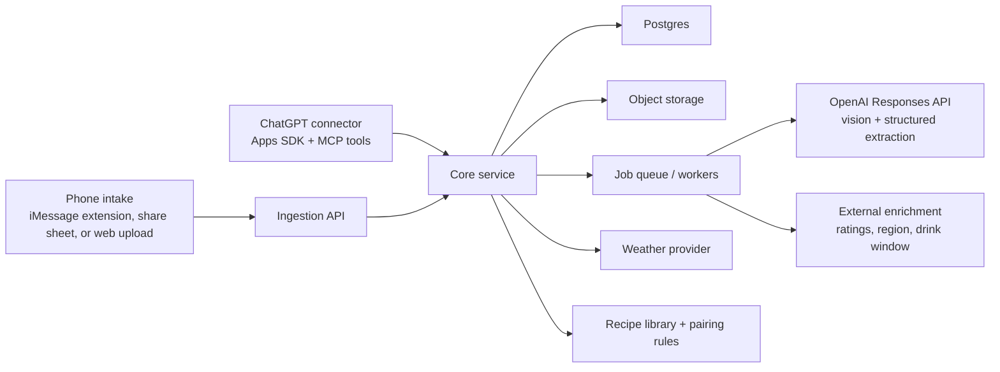

# Wine + Liquor Tracker Plan

## Goal

Build a private household system that:

- tracks wine, spirits, liqueurs, aperitifs, bitters, syrups, and selected pantry items
- accepts bottle intake from phone photos plus short text
- powers ChatGPT recommendations for wine pairings and cocktail ideas
- keeps inventory accurate as bottles are opened, finished, moved, or corrected
- can eventually support a lightweight mobile intake flow inside or adjacent to iMessage

## Product principles

- Inventory first, AI second. The database is the source of truth.
- Every recommendation must come from current inventory or explicit pantry assumptions.
- Low-confidence bottle matches always go to review instead of silently writing bad data.
- Store raw evidence: original image, extracted fields, enrichment sources, confidence, and manual overrides.
- Keep the core backend independent from the mobile intake client so we can change the front end without rewriting the system.

## Recommended v1 scope

- Import the current wine collection from a CellarTracker export.
- Add new wine and liquor bottles from image upload plus caption.
- Track one row per physical bottle so we can handle duplicates, open bottles, and "drink this soon" logic cleanly.
- Support manual corrections, opening bottles, consuming bottles, and bulk adds.
- Expose ChatGPT tools to search inventory, pair wine with a meal, suggest cocktails, and update bottle state.
- Maintain a simple review queue for uncertain image matches and enrichment results.

## Explicit non-goals for v1

- Perfect autonomous recognition for every rare or partially obscured label
- Full public multi-user SaaS product
- Complete critic-score coverage without a licensed data source
- Fully automatic "plain old iMessage thread" ingestion with no Apple-side app or automation work

## Recommended system shape

## Why this shape works

### 1. Inventory service

This is the backbone. It owns products, bottles, events, locations, and pantry assumptions. ChatGPT and mobile intake both talk to this service.

### 2. Ingestion pipeline

Photo intake should be asynchronous:

1. Save image and user text.
2. Run vision extraction into strict JSON.
3. Match against known product records or create a proposed new variant.
4. Run enrichment lookups.
5. Auto-accept if confidence is high; otherwise send to review.

### 3. ChatGPT connector

The recommendation experience should run through ChatGPT tools, not through model memory alone. ChatGPT should ask the inventory service for:

- available wine candidates
- available spirits and modifiers
- pantry assumption profile
- Chicago weather
- recipe candidates
- bottle age and drink-window urgency

### 4. Mobile intake client

Treat this as a replaceable client. The same intake endpoint should work whether the front end is:

- an iMessage extension
- an iOS share extension
- a small mobile web upload page
- a future SMS or WhatsApp integration

## Core data model

### products

Canonical product definition.

- `id`
- `category` (`wine`, `spirit`, `liqueur`, `aperitif`, `bitters`, `syrup`, `mixer`)
- `producer`
- `name`
- `country`
- `region`
- `subregion`
- `style`
- `grape_varieties`
- `base_spirit`
- `default_abv`

### variants

Bottle-specific definition.

- `id`
- `product_id`
- `vintage` for wine
- `bottling_name`
- `size_ml`
- `abv`
- `packaging`
- `upc_or_barcode`

### inventory_items

One row per physical bottle or tracked pantry item.

- `id`
- `variant_id`
- `location_id`
- `status` (`sealed`, `open`, `low`, `empty`, `consumed`, `missing`)
- `fill_percent`
- `acquired_at`
- `purchase_source`
- `purchase_price`
- `drink_from`
- `drink_to`
- `drink_window_source`
- `quality_score`
- `confidence`
- `source_system` (`manual`, `image_intake`, `cellartracker_import`)

### inventory_events

Immutable event history.

- `id`
- `inventory_item_id`
- `event_type` (`acquired`, `opened`, `poured`, `consumed`, `moved`, `corrected`, `deleted`)
- `quantity_delta`
- `notes`
- `created_at`

### media_assets

- `id`
- `inventory_item_id`
- `storage_key`
- `asset_type` (`front_label`, `back_label`, `shelf_photo`, `receipt`)

### enrichment_records

Raw and normalized enrichment.

- `id`
- `variant_id`
- `provider`
- `provider_url`
- `raw_payload`
- `matched_fields`
- `confidence`
- `last_checked_at`

### locations

- `id`
- `name`
- `type` (`cellar`, `kitchen`, `bar_cart`, `cabinet`, `fridge`)
- `temperature_profile`

### pantry_profiles

Household assumptions for common ingredients.

- `assume_lime`
- `assume_lemon`
- `assume_simple_syrup`
- `assume_soda`
- `assume_ice`
- explicit tracked oddballs such as `orgeat`, `gum syrup`, `falernum`, `green chartreuse`

### recipes

Curated cocktail recipes with ingredient graph and tags.

- `id`
- `name`
- `ingredients`
- `technique`
- `tags` (`tiki`, `stirred`, `refreshing`, `warm_weather`, `nightcap`)

## Key workflows

### 1. Import current cellar

Start by importing your current CellarTracker export so the system is useful on day one.

- Use CellarTracker's bottle-level CSV export.
- Map exported wine rows into `products`, `variants`, `inventory_items`, and `locations`.
- Keep the original export file as an import artifact for auditability.

### 2. Add a new bottle from photos

1. User sends one or more images and optional caption like "2 bottles of this from Binny's."
2. Intake API stores images and opens an ingestion job.
3. Vision model extracts structured fields: producer, wine name, vintage, region, varietal guess, size, spirit category, and visible text.
4. Matching worker searches existing products first, then external sources if needed.
5. Enrichment worker fills in ratings, drink window, style tags, and pairing tags.
6. System either:
   - writes directly to inventory if confidence is high
   - creates a review task if confidence is mixed

### 3. Ask ChatGPT for dinner wine

1. User says what meal is on deck.
2. ChatGPT tool-calls:
   - `search_inventory`
   - `get_weather`
   - `score_wine_pairings`
3. Backend returns only real bottles in stock, with drink-window urgency and pairing reasons.
4. ChatGPT explains the top one or two options in plain English.

### 4. Ask ChatGPT for cocktails

1. User gives mood, weather, spirit preference, or occasion.
2. Backend looks at available spirits, liqueurs, aperitifs, bitters, and pantry profile.
3. Recipe engine ranks drinks by:
   - ingredient coverage
   - missing-ingredient penalty
   - weather fit
   - mood tags
   - desire to use near-empty/open bottles
4. ChatGPT presents a few good options and clearly flags anything that relies on assumed pantry items.

### 5. Update inventory after drinking

Support fast language like:

- "We opened the 2016 Barolo."
- "That bottle is gone."
- "I'm out of rum."
- "Move the mezcal to the bar cart."

These should become explicit inventory events, not silent row edits.

## Pairing and recommendation logic

Use a hybrid system, not pure freeform AI.

### Wine

Backend scoring inputs:

- meal protein / fat / acid / spice
- wine body / acidity / tannin / sweetness / oak
- weather
- user mood
- drink-window urgency
- inventory depth

Recommended output:

- top candidate score
- "drink now" urgency reason
- fallback option
- explanation text written by the model from structured facts

### Cocktails

Backend scoring inputs:

- ingredient availability
- category preference
- weather and season
- time-of-day vibe
- complexity level
- open-bottle usage

Important rule: the model must not invent bottles or pantry items that the backend did not provide.

## OpenAI-specific design

### Use the Responses API

Use the Responses API for image understanding and tool-driven workflows. It supports text and image inputs, function calling, conversation state, and structured JSON outputs.

### Use structured extraction

Photo intake should return strict JSON, not freeform prose. That makes bottle matching, review, and auditing much more reliable.

### Recommended model split

- Default extraction and classification: a smaller vision-capable model to keep cost and latency reasonable
- Hard bottle disambiguation or richer pairing explanation: a stronger reasoning model

Given current OpenAI model guidance, start with a lower-latency model for routine extraction and keep `gpt-5.4` available for harder reasoning paths.

### ChatGPT integration path

For the ChatGPT experience, build an MCP server and connect it as a ChatGPT app. That gives us tool access inside normal ChatGPT conversations instead of forcing a separate custom chat UI.

Suggested first tools:

- `search_inventory`
- `get_inventory_item`
- `add_inventory_item`
- `mark_item_open`
- `mark_item_consumed`
- `update_fill_level`
- `suggest_wines_for_meal`
- `suggest_cocktails`
- `get_drink_now_candidates`

## iMessage recommendation

This is the main product-risk area.

Apple's supported paths are iMessage apps/extensions and Messages for Business. For a private household system, that means the stable path is not a generic inbound iMessage webhook bot. The practical options are:

### Option A: Supported and robust

Build an iOS app with:

- a share extension for quick photo intake
- optionally an iMessage extension for a Messages-native entry point

This is the long-term clean solution.

### Option B: Faster MVP

Use a small mobile web page or app clip style upload flow and keep the ChatGPT connector as the main recommendation surface.

This is the fastest way to get real value while we spike the Apple-side UX.

### Option C: Private automation hack

Run a Mac-based personal automation that watches messages and forwards attachments.

This can work for a private setup, but I would not build the product around it because it is brittle and hard to support.

## My recommendation

Build the backend, importer, review flow, and ChatGPT connector first. In parallel, do a small Apple spike to validate whether a share extension is enough or whether you truly want a full iMessage extension.

That keeps the hard part isolated and still gets you a useful system quickly.

## Suggested stack

- TypeScript monorepo
- `apps/api`: HTTP API for intake, inventory, recipes, and admin actions
- `apps/chatgpt`: MCP server / ChatGPT app connector
- `apps/admin`: review UI for low-confidence matches and manual edits
- `packages/db`: schema and migrations
- `packages/core`: domain models, scoring, normalization
- `packages/prompts`: extraction and explanation prompts plus schemas

Infrastructure:

- Postgres for primary data
- S3-compatible object storage for images and import artifacts
- background jobs for extraction and enrichment
- one secrets store for API keys and provider credentials

## Phased roadmap

### Phase 0: Foundations and decisions

- create repo and monorepo skeleton
- choose Postgres host and storage
- define schema and migrations
- confirm Apple intake strategy via a short spike

### Phase 1: Inventory core

- build core schema
- build CRUD and event log
- build CellarTracker CSV importer
- seed a recipe library

Success looks like: existing cellar and bar inventory are queryable.

### Phase 2: Image intake

- upload endpoint
- vision extraction
- matching and enrichment workers
- review queue

Success looks like: new bottles can be added from phone photos with human review only when needed.

### Phase 3: ChatGPT integration

- MCP server
- ChatGPT connector metadata
- inventory and recommendation tools
- meal-to-wine and mood-to-cocktail prompts

Success looks like: in ChatGPT, you can ask "what should we drink with this?" and get answers grounded in the actual database.

### Phase 4: Mobile intake polish

- share extension or iMessage extension
- quick commands for open / finished / low
- better multi-photo intake and duplicate handling

Success looks like: adding or removing bottles from the phone takes under 15 seconds.

### Phase 5: Proactive intelligence

- drink-window alerts
- "use these soon" suggestions
- low-stock bar cart reminders
- optional shopping suggestions

Success looks like: the system helps you decide before you ask.

## Biggest risks and how to handle them

### iMessage complexity

Do not tie core ingestion to unsupported message scraping. Keep all ingestion behind one API and let Apple-client work call into it.

### Data quality

Bottle matching will fail sometimes. Require confidence scoring and a review queue from day one.

### Ratings and drink windows

These are not universally available, and quality varies by source. Store source URLs and allow manual override.

### Hallucinated recommendations

Never let the model invent inventory. All recommendations should be grounded in backend-returned candidates.

## First implementation milestone

If we want the fastest path to something real, the first milestone should be:

1. import your existing CellarTracker cellar
2. model wine and liquor inventory in one schema
3. add a simple upload + review flow
4. connect the inventory service to ChatGPT with MCP tools

That gets the "what do we have and what should we drink tonight?" loop working before we tackle the Apple-specific UX.

## References

- [OpenAI Models](https://developers.openai.com/api/docs/models)
- [OpenAI Images and vision guide](https://platform.openai.com/docs/guides/images-vision)
- [OpenAI Function calling guide](https://platform.openai.com/docs/guides/function-calling/how-do-i-ensure-the-model-calls-the-correct-function)
- [OpenAI Responses API overview](https://platform.openai.com/docs/api-reference/responses)
- [OpenAI conversation state guide](https://platform.openai.com/docs/guides/conversation-state)
- [OpenAI Apps SDK quickstart](https://developers.openai.com/apps-sdk/quickstart)
- [OpenAI Connect from ChatGPT](https://developers.openai.com/apps-sdk/deploy/connect-chatgpt)
- [OpenAI MCP Apps compatibility in ChatGPT](https://developers.openai.com/apps-sdk/mcp-apps-in-chatgpt)
- [Apple iMessage Apps and Stickers](https://developer.apple.com/imessage/)
- [CellarTracker Exporting Data](https://support.cellartracker.com/article/29-exporting-data)
